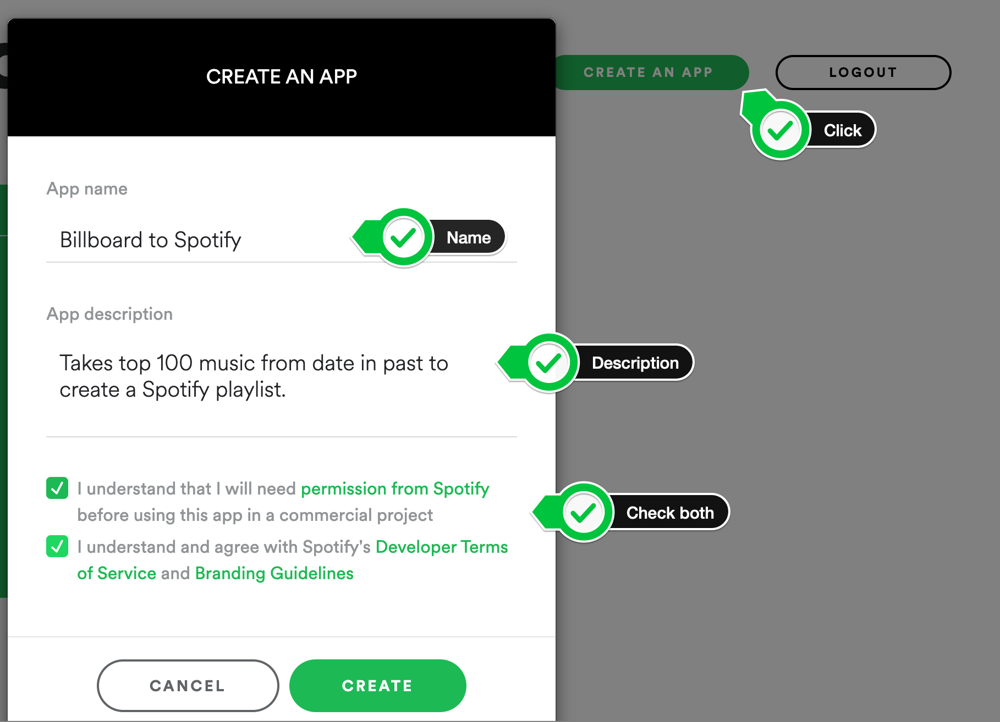

#Musical Time Machine Project
###Creating a Spotify Playlist using the Musical Time Machine
##The Goal
####How music can take you back to particular time in your life as if it's just transported you.
####By listening to the same songs that were hits during that period of time.
####It was like as if I was being transported back and could relive a moment in my childhood.
####And you might have the same experience.
##How It's done
####I used Beautiful Soup to scrape top 100 songs from a particular date of my choice.
####And then I'm extracting all the song titles from the list, and then i'm using the 
####Spotify API to create a new playlist for that particular date.
####And then i'm searching through Spotify for each of the songs and add those songs to the new playlist.
####At the end a new playlist is created that has the top 100 songs for particular date in the past.

###step 1 - Scraping the Billboard Hot 100
####Create an input() prompt that asks what year you would like to travel to in YYYY-MM-DD format.
    date = input("Which year do you want to travel to? Type the date in this format YYYY-MM-DD: ")
####Using Beautiful Soup scrape the top 100 song titles on that date into a Python List.
    from bs4 import BeautifulSoup
    import requests

    response = requests.get("https://www.billboard.com/charts/hot-100/" + date)
    # parse the html using beautiful soup and store in variable `soup`
    soup = BeautifulSoup(response.text, 'html.parser')
    song_names_spans = soup.find_all("span", class_="chart-element__information__song")
    song_names = [song.getText() for song in song_names_spans]
>Take a look at the URL of the chart on a historical date:
>https://www.billboard.com/charts/hot-100/2000-08-12

###Step 2 - Authentication with Spotify
>NOTE: In order to create a playlist in Spotify you must have an account with Spotify.

Once you've signed in, go to the developer dashboard and create a new Spotify App:
https://developer.spotify.com/dashboard/

Once you've created a Spotify app, copy the Client ID and Client Secret into your Python project.

Spotify uses OAuth to allow third-party applications (e.g. my Python code) to access a Spotify user's account without giving them the username or password. 
>read more about it here: https://developer.okta.com/blog/2017/06/21/what-the-heck-is-oauth

Using the [Spotipy documentation](https://spotipy.readthedocs.io/en/2.19.0/) , I can authenticate my Python project with Spotify using your unique Client ID/ Client Secret.

Use http://example.com as your Redirect URI. You're looking to get the currentuser id (your Spotify username). As per the documentation, make sure you set the redirect URI in the Spotify Dashboard as well.

passing the Client ID and Secret directly into the SpotifyOAuth() constructor.

And I use the ["playlist-modify-private"](https://developer.spotify.com/documentation/general/guides/scopes/) scope in order to create a private playlist on Spotify.
## Spotify Authentication
    client_id = "YOUR CLIENT ID"
    client_secret = "YOUR CLIENT SECRET"
    redirect_uri = "http://example.com"
    scope = "playlist-modify-private"

    sp = spotipy.Spotify(
        auth_manager=SpotifyOAuth(
            client_id=client_id,
            client_secret=client_secret,
            redirect_uri=redirect_uri,
            scope=scope,
            show_dialog=True,
            cache_path="token.txt"
        )
    )
 If successful, you should see the page below show up automatically (be sure to click Agree):

Then it will take you to the page below, [example.com](https://example.com/) and you need to copy the entire URL in the address bar:

Finally, you need to paste the URL into the prompt in PyCharm:

Now if you close PyCharm and restart, you should see a new file in this project called token.txt

Get the user id of the authenticated user (your Spotify username).

We need this [method](https://spotipy.readthedocs.io/en/2.13.0/#spotipy.client.Spotify.current_user):

    user_id = sp.current_user()["id"]

###Step 3 - Search Spotify for the Songs from Step 1
####creating a list of Spotify song URIs for the list of song names we found from step 1 (scraping billboard 100).

    song_uris = []
    year = date.split("-")[0]
    for song in song_names:
        result = sp.search(q=f"track:{song} year:{year}", type="track")
        print(result)
        try:
            uri = result["tracks"]["items"][0]["uri"]
            song_uris.append(uri)
        except IndexError:
            print(f"{song} doesn't exist in Spotify. Skipped.")

###Step 4 - Creating and Adding to Spotify Playlist
####creating a new private playlist with the name "YYYY-MM-DD Billboard 100", where the date is the date you inputted in step 1.
    playlist_name = f"{date} Billboard 100"

    # Creating a new private playlist in Spotify
    playlist = sp.user_playlist_create(user=user_id,
                                       name=playlist_name,
                                       public=False,
                                       description="A playlist that was created by The Musical Time Machine "
                                                   "as part of the Data Science Course of Naya College and "
                                                   "submitted to Guy Uziel. ")
####Adding each of the songs found in Step 3 to the new playlist.
    sp.playlist_add_items(playlist_id=playlist["id"], items=song_uris)

#ENJOY! :)